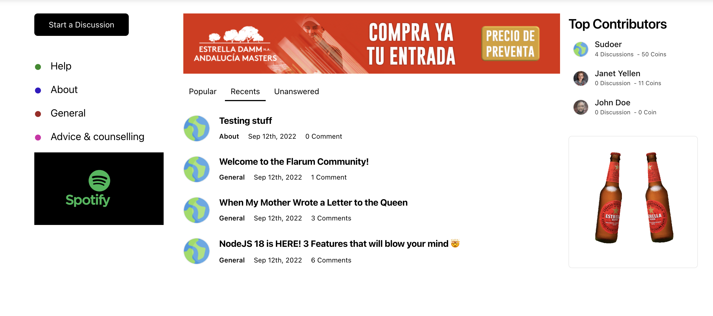
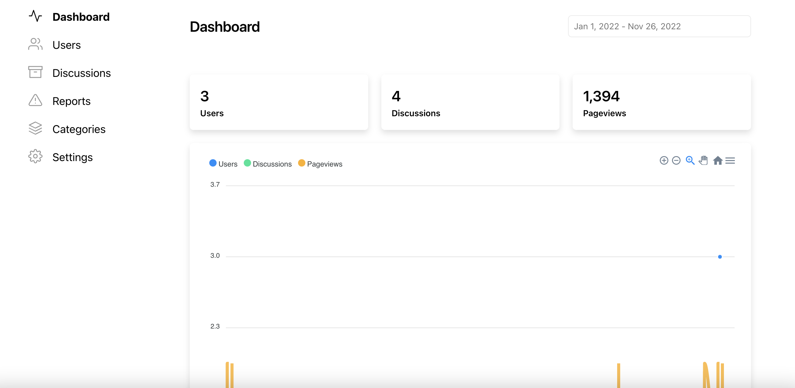
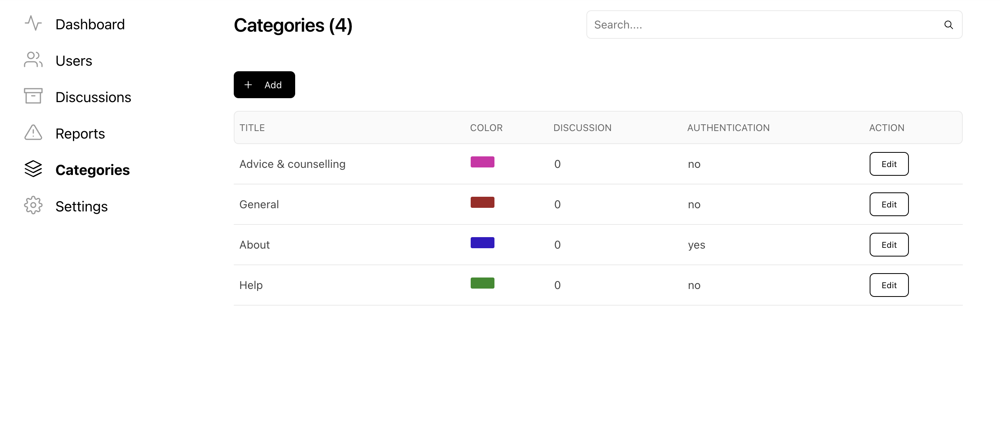
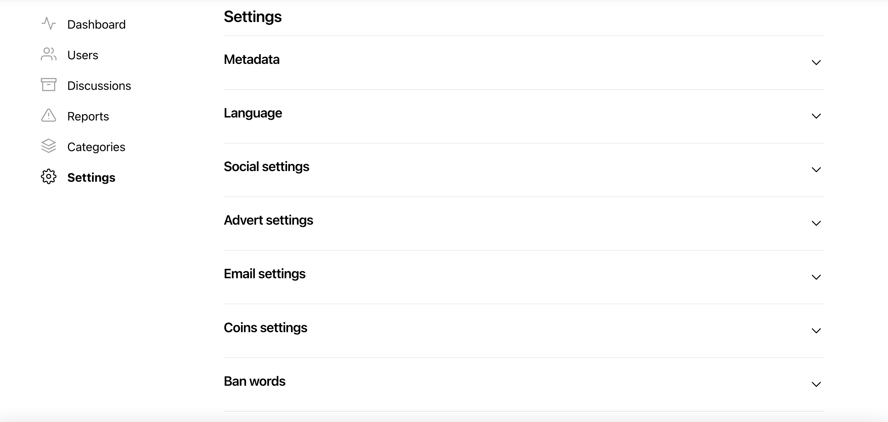

# Weiss

Modern, Minimalistic Discussion Software

[](https://www.codacy.com/gh/weissthorn/weiss/dashboard?utm_source=github.com&utm_medium=referral&utm_content=weissthorn/weiss&utm_campaign=Badge_Grade)
[](https://github.com/prettier/prettier)

### Prerequisite

- [NodeJS 12 LTS upward](https://github.com/nvm-sh/nvm/blob/master/README.md)
- [RethinkDB 2.4 upward](https://rethinkdb.com/docs/install/)






### Installation

```
yarn
```

### Development

```
yarn dev
```

### Production

```
yarn production
```

### Roadmap

- &#x2611; User system (member & moderator)
- &#x2610; Social login (Facebook, Google, Github, Twitter)
- &#x2611; Communities or categories
- &#x2611; Post and comment
- &#x2611; Social share
- &#x2610; Email notification
- &#x2611; Web notification
- &#x2610; Push notification
- &#x2611; Theming: Light and Dark
- &#x2610; Language & Translation (English, French, Arabic, Spanish etc)
- &#x2611; Coin and reward
- &#x2611; Reports and flag
- &#x2611; Advert settings
- &#x2611; Analytics, pageviews and post views
- &#x2611; Ban words
- &#x2610; Docker image
- &#x2610; Kubernetes
- &#x2610; Digital ocean marketplace
- &#x2610; AWS marketplace

### How to contribute

Fork the code, update and make a pull request.

### [License](LICENSE)

### Maintainers

[Olalekan Animashaun](https://github.com/kimolalekan)
